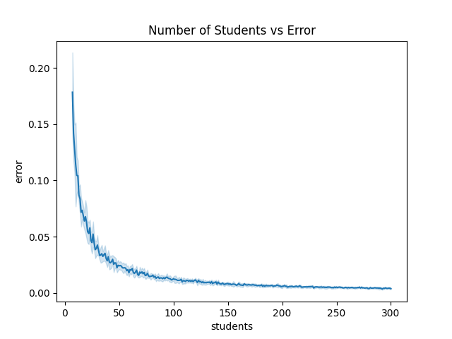

# Determining Rotation Matching Using Linear Sum Optimization
## Authors
1. a[Roshan Lodha](https://roshanlodha.github.io)
2. aNeil Mehta, aCraig Nielsen

aCleveland Clinic Lerner College of Medicine 
## Introduction
Third-year medical students complete a series of core rotations in internal medicine, surgery, paediatrics, obstetrics, gynecology, neurology, psychiatry, and family medicine. Elective rotations often require a prerequisite core rotation; for example, to enroll in the orthopedics elective, students must first complete the core surgery rotation. Thus, students tend to have a preference for the order in which they are assigned to these rotations.

{tori can you help with the introduction? it would be helpful to pull statistics from online about medical students and specalities and such}

Currently, rotation matching is done psuedo-stochastically, posing a huge time cost. Unequal student preferences in rotation order lead to challenges in finding an optimal assignment for all students, and simply using rank-based preference matching assigns the problem of cost of an unfavorable preference away from the student. Here we propose a student-centered rotation assignment algorithm that finds the optimal student-order pairing. Notably, we allow students to choose the cost of an unfavorable assignment on an individual basis while ensuring an equal amount of students are assigned to each order.

## Methods

### Problem Formulation and Encoding
We reframed the problem of optimal rotation order as an minimum-cost assignment problem. Each student has the option of `k` rotation orders {add a table 1 with the order, abreviation, and the full meaning} which they assigned a cost to. These costs were used to formulate an `n` x `k` tall matrix, with `n` students each with `k = 4` rotations.

#### Determining Costs 
Students were given `b` "beans" and were asked to divide assign these beans however they would like to the rotation orders. Null submissions were assigned `b / k` beans to each rotation. All responses were scaled such that the sum of beans was exactly `b`. Each rotation order's assigned beans was then converted to a cost by subtracting it from `b`. For example, if a rotation was assigned `c` beans, its associated cost would be `b - c`. Generally, the optimal number of beans is 0 in moduli space `b`. Hyperparameter optimization is used to determine the optimal number of beans for a given application.

### Algorithm Design

#### Matrix Padding
Linear sum optimization requires a wide or square matrix. Thus, we add phantom students with no rotation order preference until the number of rows is 0 in moduli space `k`. Subsequently, we tile the matrix to a width of `⌈n / k⌉` resulting in a `⌈n / k⌉ * k` by `⌈n / k⌉ * k` square matrix. The row order was randomly shuffled to ensure that submission time was not a factor in determining rotation order preference. 

#### Linear Sum Optimization
The optimal rotation order was calculated by calculating the linear sum optimization on the padded, square cost matrix in Python (SciPy: 1.9.3, Python 3.9.6).

### Error Testing
To determine the performance of the rotation assignment, we defined a novel error metric, δ, as the `total_cost / n / b, {δ ∈ R | [0, 1]}`. 

## Results

### The optimal number of beans is highly variable.
An optimal number of beans was selected using hyperparameter optimization. For ease of student use, the minimum number of beans was chosen to be `k!`, as it allows for integer divisions between rotation orders. Testing across a wide range of beans revealed that a minimum number of beans minimized error (Figure 1). The cost matrix was sampled randomly and uniformly.

|  |
|:--:| 
| *Figure 1. Error versus number of beans.* |

Analysis of a sample set of real world data showed a skew towards certain rotation orders. Further testing must be done to determine how the number of beans effect the overall error under various sampling distributions. We hypothesize that in real world deployment, increasing the number of beans would decrease the error due to sampling skew and a maximal difference between costs for a given student.

### The error reduces as the number of students increases. 
As the number of students increases, the total delta error decreased exponentially (Figure 2). In other words, the error was roughly constant despite increasing the number of students, suggesting better performance as the number of students increases.

|  |
|:--:| 
| *Figure 2. Error versus number of students.* |

### Deployment and Student Satisfaction
* real world this year (number of swaps, satisfaction, etc.)
* compare number of post-assignment swaps from previous years vs this year

## Discussion

### Key Findings

#### Optimality and Completeness
In our problem, optimality was defined as a rotation order assignment in which no single swap would benefit all students involved in the swap. Completeness was defined as both an equal number of students assigned to each rotation order as well as all students being assigned to exactly 1 rotation order. In the case that the number of students was not 0 in the moduli space `k`, completeness was defined as a difference of no more than 1 student between the most filled and least filled rotation group. Linear sum optimization provides an optimal solution by definition. Completeness was ensured by matrix padding.

#### Limitations
Real world behavior in rotation order selection is poorly modeled by a uniform distribution. Sampling of students preferences reveals high preferences for certain rotation orders. In practice, we found that rotation order 4 > rotation order 3 > rotation order 2 > rotation order 1 (Table 1).

| Option | Order                    | Beans Assigned | Number First Choice |
|--------|--------------------------|----------------|---------------------|
| 1      | LAB - TBC2 - TBC3 - TBC1 |                |                     |
| 2      | TBC2 - LAB - TBC1 - TBC3 |                |                     |
| 3      | TBC3 - TBC1 - LAB - TBC2 |                |                     |
| 4      | TBC1 - TBC3 - TBC2 - LAB |                |                     |
|:--:| 
| *Table 1. Findings from real-world deployment.* |

This selection lead to an increased number of students recieving a deeply unfavorable rotation order based on their choice of bean assignment. 

#### Optimal Student Strategy
Due to a student-determined cost penalty and the unequal popularity of certain rotations, students could employ game theory to optimize their odds of recieving a certain rotation. For simplicity, consider a scenario with 75 students, where every student wanted rotation order 1 and no students wanted rotation order 4. In this case, only a maximum of 19 students could recieve the top choice rotation. Thus, students had the option of assigning all their beans to rotation order 1 to maximize their chance of getting this rotation. However, if more than 19 students employed this strategy, several would be randomly assigned to a different rotation. Due to the relative unpopularity of rotation order 4, it is likely that most of these students would be assigned to this rotation. Hence, it may benefit students to "take the L" and assign all their beans to their second choice rotation.

Our algorithm allows for easy modification and eliminated of this aspect by having students rank their preferences followed by deterministic assigning a cost penalty to an unfavorable rotation order without the students consultation. In practice, this was not used as to increase input from students. 

### Future Directions

#### Skewed Costs
Applying a weight to the cost matrix can skew the results to avoid assigning students to their last-choice preference. For example, adding an exponential penalty would more significantly penalize rotation orders with fewer beans, skewing the optimal result away from those set of solutions. Our algorithm allows for easy modification of a cost matrix. Hyperparameter optimization should be used to determine the best cost penality function for a given application. 

#### Adding Distance Penalties
Within each rotation, students can be placed at several sites. Suburban hospital campuses pose an additional cost to students in the form of travel. Future iterations of a non-random rotation matching algorithm can modify the cost function based on the distance a student has to travel to a given rotation. An example implementation could be to recursively run the algorithm within each rotation assignment using the distance traveled in miles as the of a rotation.

#### Adding Couples Matching
Often, students live with another medical student partner. In order to encourage carpooling, the cost function can be further modified to increase the odds that two students are placed in the same rotation.

## References
1.  Munkres J. Algorithms for the Assignment and Transportation Problems. Journal of the Society for Industrial and Applied Mathematics 1957;5(1):32–8. 
2.  Crouse DF. On implementing 2D rectangular assignment algorithms. IEEE Transactions on Aerospace and Electronic Systems 2016;52(4):1679–96. 
3.  Kuhn HW. The Hungarian method for the assignment problem. Naval Research Logistics Quarterly 1955;2(1–2):83–97. 
4.  Kuhn HW. Variants of the hungarian method for assignment problems. Naval Research Logistics Quarterly 1956;3(4):253–8. 